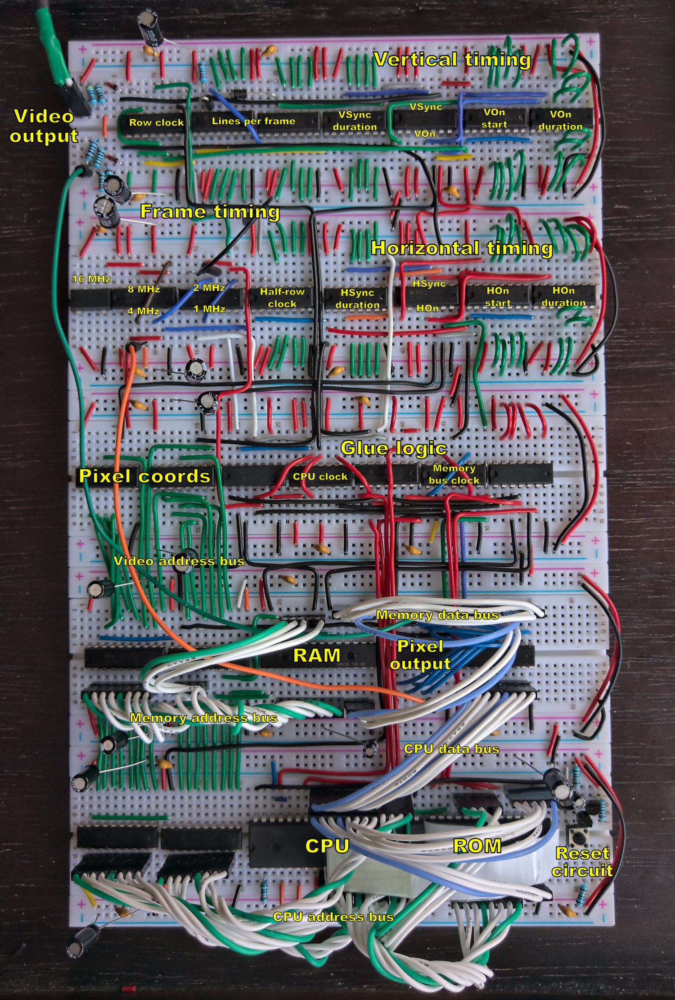
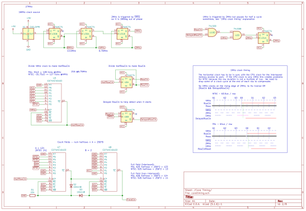

# Composite/component video controller for homebrew 6502 computers

 |

This is my second iteration video output circuit for homebrew 6502 computers.  It's designed to work in a way that's fairly close to
how early 80s microcomputers tended to work, which means RAM shared between CPU and video controller, as this tends to provide the
fastest possible access for the CPU to the video memory.

In this second iteration, the main change from V1 is that the timings are easily configurable, allowing it to support NTSC as well
as PAL with just a few jumper changes, as well as non-standard sync timings if you want to experiment; and the image placement and
size is also easily configurable.

You can also use interlacing to double the vertical resolution to 512 pixels, and if you swap the clock crystal and adjust some
other timings, you can double the horizontal resolution as well.

More involved, higher clock frequencies and maybe more counters would also allow HD resolutions such as 720p and 1080i, though I
haven't tried those yet, and VGA if you also change the output layer to output plain RGB.

The limiting factor at these higher resolutions becomes memory - 384x256x2 already uses nearly half of the RAM.  I'm considering
addressing this through a banking scheme in an upcoming V3.

Here's some example output, from the default 384x256x2 configuration:

# Project contents

This project contains:
* Full KiCad schematics for the new design (<a href="images/compvideo6502_schematic.pdf">also available in PDF format</a>)
* A "PCB" layout that represents how you could build this on an array of five breadboards

This includes the 6502, RAM, ROM, oscillator, reset circuit, and address decoding circuits, along 
with the video controller.  If you're already happy with the way you're doing those in an existing system then you could mostly 
keep your old design instead, but the RAM and clock need to be integrated here, in order to be shared with the video controller.

# Next steps and expansion ideas

There are a few things I plan to do next, and I'm not sure what the order will be.  Feedback/contributions welcome - let me know 
if you try these or have other ideas!

* Upload some OS code - I have the code from my previous iteration which should work pretty well
* Document and explain it, maybe make a step-by-step build-and-test guide, video tutorial, or something like that
* Make some games for it!  That was the whole point really, having a video output circuit that's fast enough to support 
the kinds of game I grew up playing
* Colour output - using component video, pretty simple to add
* Higher resolutions?  Doubling the horizontal resolution is possible with the right pixel frequency (13.5MHz instead
of 16MHz) - and doubling the vertical resolution also works fine through interlacing.  Component video can also go up to 1080i I 
think, but can't find good specs on the sync frequencies for that.
* VGA output?  It's fairly similar, just higher frequency - but may be possible by swapping the crystal and adjusting the timings.  
It's why I wanted to make this more configurable than my first one.
* Planar video memory, as used on EGA and VGA graphics cards on PCs - I've always found it an interesting architecture, and it 
seems like a good way to implement colour output without needing faster memory
* Software control over the timing registers would be very neat and not very hard to do

# Caveats

The output impedance isn't exactly what it's meant to be, but it's close enough I think.

The 16MHz base frequency is what the BBC Micro used back in the day, but I think in the digital age the standard pixel sampling 
frequency for SDTV is 13.5MHz.  As a result, on an LCD display you get blurring and moire effects at 8MHz; and at 16MHz you lose 
most of the pixel detail completely.  I think with a 13.5MHz base frequency the picture would be sharper overall.

My first iteration output correct pre- and post-vsync equalization pulses, and serrations during the vsync; I left that out this 
time around as it doesn't seem to be necessary these days.  Maybe I'm missing something though.  As far as I can tell chips like 
the 6845 never supported this anyway - at least it's not mentioned in the datasheets.  So I'm guessing that since at least the 
1980s nobody has bothered with them.

I haven't worked out interlacing yet.  Websites say that you can turn it off with the right combination of sync pulses, but my TV
always says it's interlaced, so either I'm doing it wrong, or the TV just never says "576p" anyway.  The design here is
intentionally fully-interlaced, which might lead to increased vertical resolution in the end.  It should be possible to uninterlace
it with a small change to the sync timings.  Actually I suspect that this is becase composite doesn't support progressive scan -
with component video the non-interlaced mode might work better.

I used a lot of 74HCT40103s in this design - they're incredibly useful, and were fundamental to the simplification and tweakability 
of the timings in this design.  However it seems they might be harder to find online than other chips I tend to use - I had to 
order a second batch, and it was harder to find them this time around.  So maybe it wasn't the best choice...  It's possible to use 
74HCT163s instead, but you'll need more of them as they're only 4-bit counters.

